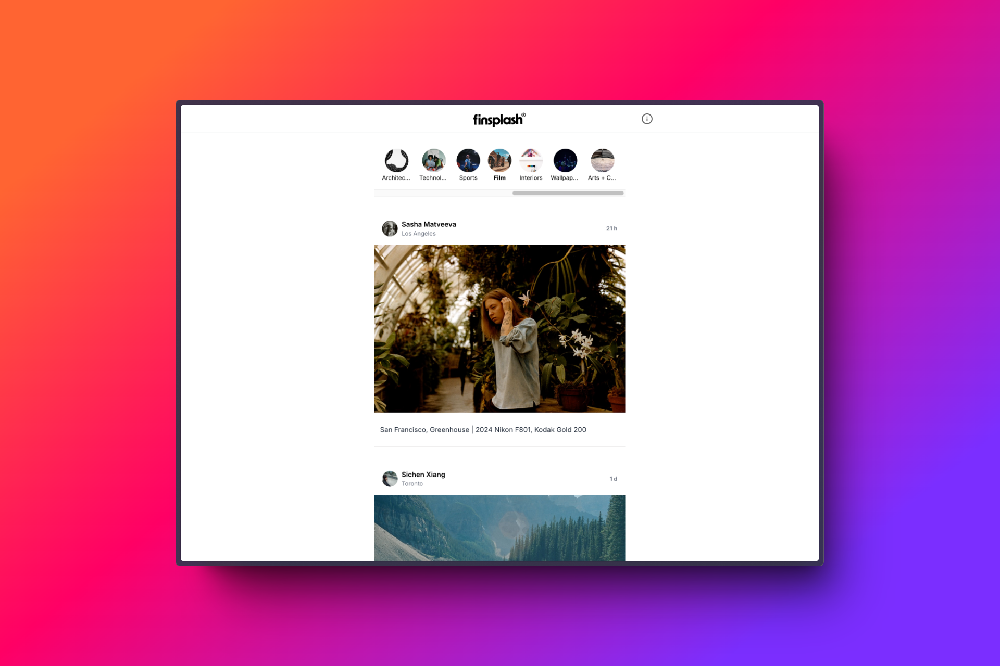

# Finsplash - A new way to experience Unsplash

## 🦊 Objective

I love Unsplash and also love its iOS app but sometimes I can be a bit of a struggle to find new submissions. I thought it would be quite cool to create an Instagram-like UI to experience Unsplash based on when an image was posted.

## 🐻 Tech

The app is serverless and is built with React. I'm using the Unsplash API to grab all the data so didn't need to create or use a backend. Each image and User has a link which takes the user to the Unsplash.

## 🐵 Feedback

Depending on many factors, i am unlikely to add new features to it unless there is a huge demand for it. If you have any ideas for improvements or want to report bugs, feel free to contact me at asamshah.com.

